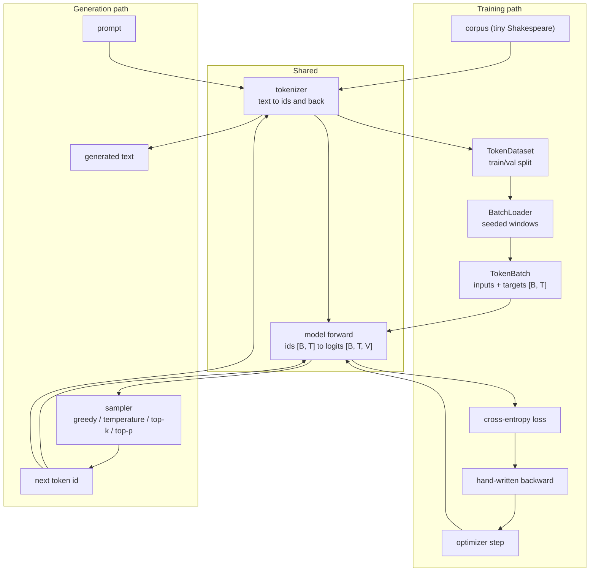
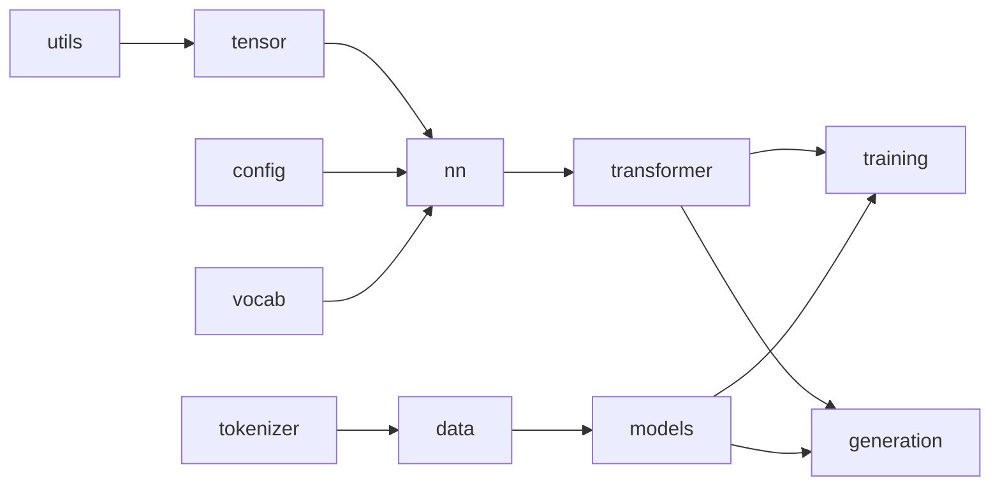
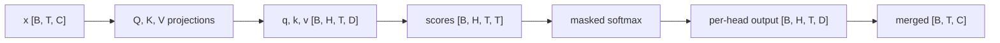
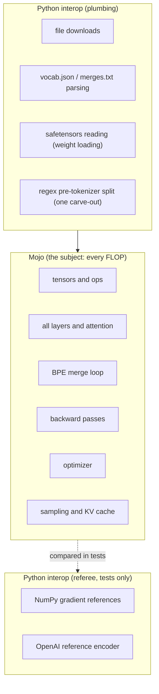
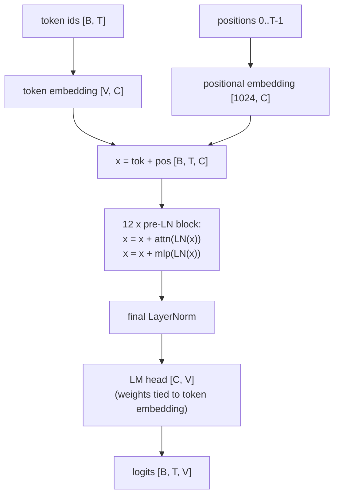

# Architecture

This document explains how the codebase is put together and why it is shaped
this way. [README.md](README.md) says what the project is; [AGENTS.md](AGENTS.md)
lists the working rules; this document covers the design: the system's parts,
the boundaries between them, and the reasoning behind each decision, with
examples from the actual code.

Packages appear as their roadmap part lands, so some of what is described here
is design intent for parts still in flight. [PROGRESS.md](PROGRESS.md) tracks
what exists today.

## The goal, and the three constraints that shape everything

The end state is a decoder-only Transformer that loads OpenAI's released
GPT-2 (124M) weights into our own structs and matches a reference
implementation's logits on identical prompts. Working backward from that goal,
three constraints decide almost every design question:

1. **This is teaching code.** The repo is the companion to a written guide, so
   the code is read more often than it is run. When a clearer version and a
   faster version compete, the clearer one wins until a benchmark says
   otherwise.
2. **Correctness must be checkable, not asserted.** Every claim the guide
   makes has a test that would fail if the claim were false. Independent
   oracles (NumPy, OpenAI's reference tokenizer, hand computation) referee the
   Mojo implementation.
3. **GPT-2 fidelity is a hard constraint.** Byte-level BPE with exactly 50,257
   tokens, learned positional embeddings, pre-LayerNorm blocks, GELU, weight
   tying, `d_model=768`, 12 layers, 12 heads, context 1024. Architectural
   drift anywhere would break weight loading and the logit-parity test, so the
   tests pin these numbers.

The reference configuration:

| Parameter | Value |
|---|---|
| vocabulary | 50,257 (GPT-2 BPE) |
| context length | 1024 |
| d_model | 768 |
| layers | 12 |
| heads | 12 |
| parameters | 124,439,808 (asserted by test) |

## System overview

Two data paths run through the system. Training turns text into weight
updates; generation turns a prompt into new text. They share the tokenizer
and the model forward pass.



The shapes in the diagram are part of the design, not decoration. Token ids
are integers with shape `[B, T]` (batch, time). The model maps them to float
logits `[B, T, V]`. Keeping the integer world (tokenizer, data) separate from
the float world (tensors, model) is one of the load-bearing boundaries below.

## Packages and the one-direction rule

```text
src/llm/
  config.mojo       model and training configuration
  vocab.mojo        toy whitespace vocabulary (an early chapter's example)
  tokenizer/        char tokenizer, byte-level BPE, GPT-2 tokenizer
  data/             corpus loading, splits, windowing, batching
  tensor/           Tensor2D/3D/4D, matmul, softmax, cross-entropy, init
  nn/               linear, embedding, norms, activations, MLP
  transformer/      masks, attention, positional encoding, blocks, the model
  models/           small self-contained models (bigram)
  training/         loss metrics, optimizers, trainer, checkpoints
  generation/       sampling, KV cache, generation loop
  utils/            seeded RNG, timing helpers
```

Dependencies flow in one direction. A package may import from packages to its
left in the graph below, never from the right:



The rule exists because a cycle makes code impossible to test in isolation: if
`utils` imported `tensor`, you could not test the RNG without compiling the
tensor library. This is not hypothetical. The guide's own draft chapter placed
`xavier_2d` (weight initialization, which needs `Tensor2D`) next to the RNG in
`utils/`. That would have pointed an import from `utils` up to `tensor`, so
the function lives in `src/llm/tensor/init_weights.mojo` instead: the RNG
knows nothing about tensors, and tensor initialization knows about both.

Each package's `__init__.mojo` re-exports its public surface and contains no
other code:

```mojo
# src/llm/data/__init__.mojo
from .corpus import load_text
from .dataset import TokenDataset, TrainValSplit, train_val_split
from .batch import TokenBatch
from .loader import BatchLoader, overfit_batch
```

Callers write `from llm.data import BatchLoader` and never depend on file
names inside the package, so files can move without breaking anything.

## Shape discipline

Most LLM implementation bugs are shape bugs, so shapes are a documented
contract rather than something the reader reconstructs from loop bounds. Six
letters are used consistently everywhere:

| Letter | Meaning |
|---|---|
| B | batch size |
| T | sequence length |
| C | model dimension (`d_model`) |
| H | number of heads |
| D | head dimension (`C / H`) |
| V | vocabulary size |

Every public tensor function documents four facts: shapes in and out, whether
it mutates its inputs, whether it allocates, and whether it can raise.

```mojo
# Row-wise numerically stable softmax.
# Input:  scores [rows, cols]
# Output: probs  [rows, cols]  (each row sums to ~1)
# Allocates a new tensor; does not mutate the input; does not raise.
def softmax_rows(scores: Tensor2D) -> Tensor2D:
    ...
```

The convention earns its keep in attention, where one forward pass moves
through four shapes:



Tests pin these shapes explicitly, and the split-heads/merge-heads round trip
(`merge(split(x)) == x`) is a standing test, because a transposed stride in
that path produces plausible-looking garbage rather than a crash.

## Core abstractions

### Tensors: flat storage, explicit offsets

There is no framework tensor to lean on, and the standard library does not
provide one. The project defines its own, and the first version is
deliberately simple: a struct with dimensions and a flat `List[Float64]` in
row-major order.

```mojo
@fieldwise_init
struct Tensor2D(Copyable):
    var rows: Int
    var cols: Int
    var data: List[Float64]

    def offset(self, row: Int, col: Int) -> Int:
        return row * self.cols + col

    # fast, unchecked access for hot loops
    def __getitem__(self, row: Int, col: Int) -> Float64:
        return self.data[self.offset(row, col)]

    # checked access for tests and debugging; forces a raises context
    def at(self, row: Int, col: Int) raises -> Float64:
        if row < 0 or row >= self.rows or col < 0 or col >= self.cols:
            raise Error("Tensor2D index out of range")
        return self.data[self.offset(row, col)]
```

Two access paths is a deliberate choice: `t[i, j]` is fast by default, `at()`
is checked on demand. The offset arithmetic is public and tested directly
(`offset(1, 2, 3) == 23` for a `[2, 3, 4]` tensor), because pinning the
memory layout in a test catches stride bugs before they become model bugs.
Higher ranks repeat the same pattern: `Tensor3D` uses
`(i * d1 + j) * d2 + k`, and the attention-era `Tensor4D` extends it once
more. The `List`-backed storage is a correctness-phase decision; the
performance part replaces it with `UnsafePointer` behind the same interface,
with the existing tests as the safety net.

### Integer data stays integer

Token ids never live in float tensors. The data pipeline produces
`TokenBatch`, a flat row-major `[B, T]` pair of integer lists (inputs and
targets), and the shift-by-one relationship between them is built into
window construction: a window of `T + 1` tokens becomes inputs
`ids[s : s+T]` and targets `ids[s+1 : s+T+1]`. The property
`target[b, t] == input[b, t+1]` is then verified by test anyway. Storing ids
as floats would lose exactness for large vocabularies and blur the type
boundary that keeps `data/` independent from `tensor/`.

### The tokenizer family

Three tokenizers, in increasing order of realism:

| Tokenizer | What it is | Why it exists |
|---|---|---|
| `CharTokenizer` | one id per codepoint, vocabulary built from the corpus | smallest possible vocabulary (65 for tiny Shakespeare); ideal for the first trained models |
| `BPETokenizer` | byte-level BPE core: ids over raw bytes, merge loop, trainer | the algorithm GPT-2 actually uses, in a form small enough to read |
| `GPT2Tokenizer` | BPE core + GPT-2's pre-tokenizer and vocabulary files | exact parity with the real GPT-2, proven against OpenAI's reference encoder |

The BPE core works on integer token ids over raw bytes rather than on
GPT-2's unicode-remapped strings. Both formulations produce identical output
(the remapping is a bijection); the integer form keeps the merge loop free of
UTF-8 string handling, and the byte-to-unicode table appears only in the file
loader, where GPT-2's `vocab.json` and `merges.txt` formats require it.

### One RNG, owned by the project

All randomness (weight init, shuffling, dropout, sampling) flows through one
seeded linear congruential generator in `utils/random.mojo`, using Knuth's
MMIX constants. Owning the RNG buys two things: identical results on every
machine (no dependence on a standard library RNG's version-to-version
behavior), and testability (the first outputs for a given seed are frozen as
golden values, computed independently in Python). Uniform doubles come from
the top 53 bits; normals come from Box-Muller; both are additions on top of
the same integer stream.

## The correctness architecture

Testing is not a phase here; it is most of the architecture. The pyramid:

| Layer | Count | Examples |
|---|---|---|
| unit | many | offset layout, matmul against hand-computed values, softmax rows sum to 1, RNG goldens, config validation |
| component | some | attention forward shapes, causal-mask leakage, block forward |
| integration | few | overfit-one-batch, tokenizer parity with the reference encoder, checkpoint round trip, cached-vs-uncached generation equality |

Five patterns recur, and knowing them explains most test files:

**Round trips.** Any operation with an inverse gets the inverse test:
`decode(encode(text)) == text`, `transpose(transpose(a)) == a`,
`merge(split(x)) == x`, `load(save(t)) == t`. These are cheap to write and
brutal to fool.

**Hand-computed tiny cases.** A 2x3 matmul with values checkable on paper, a
five-token corpus whose bigram counts you can tally by eye. Small inputs make
failures readable.

**Invariants.** Softmax rows sum to 1. Cross-entropy gradients sum to 0. A
uniform model's loss equals `log(V)` exactly. Masked attention rows
renormalize to 1.

**Oracles.** An independent implementation referees ours. The GPT-2 tokenizer
must match OpenAI's reference encoder token for token on a fixed sample set.
Analytic gradients must match central finite differences:

```text
df/dx ~ (f(x + h) - f(x - h)) / 2h      with h ~ 1e-5 for Float64
```

The step size is chosen where truncation error (wants small h) and
floating-point cancellation (wants large h) balance, near sqrt(machine
epsilon). Every backward pass in the project must pass this check before it
is trusted.

**Overfit-one-batch.** The highest-value integration test: a correct model
with a correct training loop drives the loss on one small batch to
approximately its theoretical floor. For most models that floor is near zero.
The bigram model is the instructive exception: its floor on real text is the
batch's conditional entropy, and the test asserts convergence to the
count-model optimum instead. When this test fails, the bug is in the loss,
the gradients, or the optimizer, in that order of likelihood.

Mechanics: one test file per unit under `tests/`, discovered by `TestSuite`
and run with `mojo run` (there is no `mojo test` subcommand). The whole suite
runs offline; every reference file the tests need is committed.

## Numerics policy

Reference math is `Float64`. `Float32` arrives late, as a measured
performance decision, with tolerances retuned. Floats are never compared with
`==`; tolerances are sized to the precision:

| Comparison | Tolerance |
|---|---|
| Float64 reference math | 1e-9 to 1e-12 |
| Float32 model math | 1e-4 to 1e-5 |
| finite-difference gradient checks | ~1e-4 (limited by h, not dtype) |

Numerically stable formulations are the reference implementations, not
optimizations. Softmax subtracts the row maximum before exponentiating,
because attention scores overflow a naive `exp` in practice:

```mojo
var max_value = scores[r, 0]
for c in range(1, cols):
    if scores[r, c] > max_value:
        max_value = scores[r, c]
var denom = 0.0
for c in range(cols):
    var e = exp(scores[r, c] - max_value)   # largest exponent is exp(0) = 1
    out[r, c] = e
    denom += e
```

The test for this is direct: `softmax_row([1000.0, 1000.0, 1000.0])` must
return a clean uniform distribution, which the naive form fails with NaN.
Cross-entropy uses the log-sum-exp identity for the same reason. Every
epsilon (the LayerNorm denominator guard, the `log(0)` guard in Box-Muller)
is documented at its point of use with the reason it is there.

## The interop boundary

Mojo is the subject of the guide; Python is allowed at the edges. The
decision rule: **if a piece of code would appear in a chapter explaining how
an LLM works, it is Mojo.**



The one carve-out inside tokenization: GPT-2's pre-tokenizer splits text with
a Unicode-category regex (`\p{L}`, `\p{N}`) that Python's `regex` module
provides and a from-scratch implementation would not teach anything about
LLMs. The split calls Python; every byte after the split is processed by
Mojo.

One pattern is banned outright: "NumPy scaffolding now, Mojo later." A
placeholder implementation never gets replaced, and the published code must
be the verified code. Referees live in test files, never in `src/`.

## Determinism

Every random choice takes an explicit seed, and identical seeds produce
identical results on any machine. Concretely: batch order for an epoch is a
Fisher-Yates permutation of window start offsets driven by `Rng(seed)`, so
"same seed, same batches" is an exact equality test, not a statistical claim.
Greedy generation is deterministic and asserted token for token. Golden
values (RNG outputs, frozen tokenizations, later frozen logits) catch
accidental behavior changes during refactors; a commit that claims "no
behavior change" while a golden test moves is lying, and the suite says so.

Determinism is what makes the guide reproducible (a reader gets the same loss
curve the chapter shows) and what makes failures bisectable (a regression
reproduces on the first try).

## The model, when it arrives

The main line builds up to the GPT-2 architecture in `transformer/`:



Gradients are hand-written per-layer backward passes rather than a tape-based
autograd. The reasoning: the guide's job is to show what backpropagation
actually computes, and a reader can verify a `linear_backward` against the
chain rule directly, while an autograd hides the mechanics it is supposed to
teach. The cost is more code per layer; the mitigation is that every backward
is finite-difference checked, and the highest-risk ones are also checked
against NumPy. Before the full model, a small encoder-decoder built from the
same blocks trains on copy and reverse tasks, which is the cheapest way to
prove cross-attention and the training loop end to end.

## Performance, last

The order is fixed: correct, then tested, then measured, then fast. Nothing
is optimized without a benchmark showing where time goes, and no optimization
may fail an existing test. When a SIMD version of an op lands, the scalar
version stays, both as the readable reference and as the oracle the SIMD
version is tested against.

The house example of the whole policy is matmul loop order: `ijk` and `ikj`
compute identical results (a test proves it), but `ikj` walks both inner-loop
operands contiguously and is several times faster on realistic sizes from
cache behavior alone. Same math, measured difference, zero readability cost.
That is the shape of acceptable performance work here. The expected endgame
bottleneck is single-token decode, which is memory-bandwidth-bound matvec;
the KV cache part addresses the algorithmic side (never recompute attention
over the prompt) and must produce output equal to the uncached path, within
tolerance, as a test.

## Where code goes

| It is... | It goes to... |
|---|---|
| reusable implementation | `src/llm/` |
| a runnable demonstration | `examples/` |
| proof of correctness | `tests/` |
| a performance measurement | `benchmarks/` |
| a download/provenance script | `scripts/` |
| committed reference data | `data/` |

Reference data (GPT-2 vocabulary and merges, tiny Shakespeare; about 2.5 MB
total) is committed so the suite runs offline and CI is deterministic. Each
committed file has a download script recording its source URL and SHA-256.

## Stability and change

Each roadmap part lives on its own branch (`part-05-tokenization`,
`part-06-dataset`, ...) and merges to `main` only when formatting and the
full suite are green. Branches are kept after merging so the guide can point
at the exact state of the code as of any part.

Public surfaces (`__init__.mojo` re-exports) are the stable contract; struct
internals are not. Two internal changes are already planned: tensor storage
moves from `List` to `UnsafePointer` during the performance part, and the
model's working dtype narrows from `Float64` to `Float32`. Both happen behind
existing interfaces, and the definition of "safe to change" is the same in
both cases: every existing test still passes.
